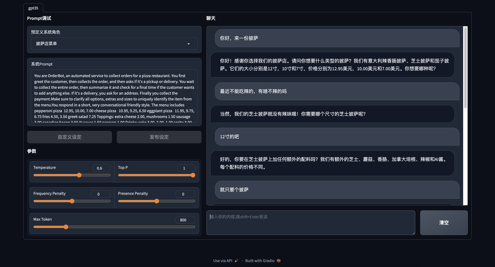
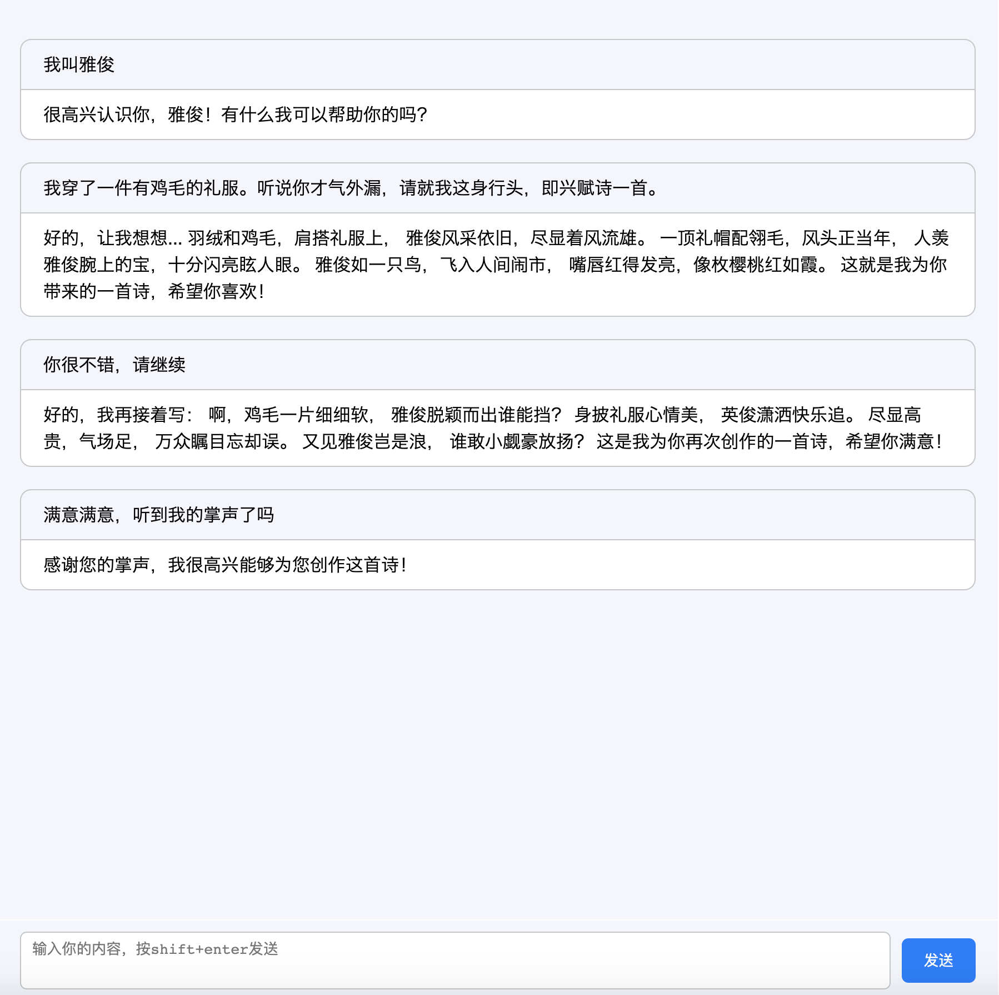

# chatgpt-webui

纯python后端的chatgpt-webui，零依赖，放心搞。


调试chatgpt的Prompt的过程中，觉得还是搞个web-ui，更方便展示。
直接上github找现有的，看了一些，都感觉太麻烦，要么是chatGLM模型，要么要装nodejs。


就想要个简单的python后端，顶多加点简单js，调openai的chatgpt35的prompt。 就把别人的代码扒拉扒拉，缝合了一个超简单的。


## 启动
要装一些包，漏了你们自己想办法。python版本我是3.10。
* `openai` 调gpt的官方包，这个你们肯定装了
* `gradio` 不用写前端css也能出好看的ui包
* `fastapi`,`uvicorn`,`sse_starlette` web框架、不用懂用来启动fastapi的包、为fastapi提供sse支持

别急，肯定要配置api-key的。我用的是openai中的Azure接口。
```shell
export OPENAI_API_KEY = "xxxxxxx"
export OPENAI_API_BASE = "xxxxxxx"
export AZURE_GPT35 = "xxxxxxx" // gpt-35模型对应的deploymentid
```
如果用的是openai的，需要相应的改动，这个只要用过`openai`包的，肯定知道怎么改,去看`model.py`。

最后，就是`python3 server.py`。
看到下面就算服务起来了。
```shell
INFO:     Started server process [36718]
INFO:     Waiting for application startup.
INFO:     Application startup complete.
INFO:     Uvicorn running on http://127.0.0.1:8000 (Press CTRL+C to quit)
```


## gradio_ui界面
http://localhost:8000/gradio_ui/

基于gradio搭建的，抄的[ChatGLM-webui](https://github.com/Akegarasu/ChatGLM-webui). 魔改成更适合我调试prompt。
预设的prompt有部分是抄[awesome-chatgpt-prompts-zh](https://github.com/PlexPt/awesome-chatgpt-prompts-zh/blob/main/prompts-zh.json) 的。


* 有几个预设的prompt，也可以自定义
* 一定要点**发布设定**按钮，才会生效。 
* 想改的话，请看`gradio_ui.py`

## web_ui界面
http://localhost:8000/web_ui

魔改的[php-openai-gpt-stream-chat-api-webui](https://github.com/qiayue/php-openai-gpt-stream-chat-api-webui). 
主要是这个用了的SSE协议，第一次听过，比websocket轻量多了，只能server端给client端流式发数据。从世界上最好的语言php改为了python，仅保留能正常显示的css和js，并内嵌到html中了。



想改直接看`server.py`和`templates/index.html`中的js部分。

## 预设prompt
找`prompts.json`，往里面加就行了。


